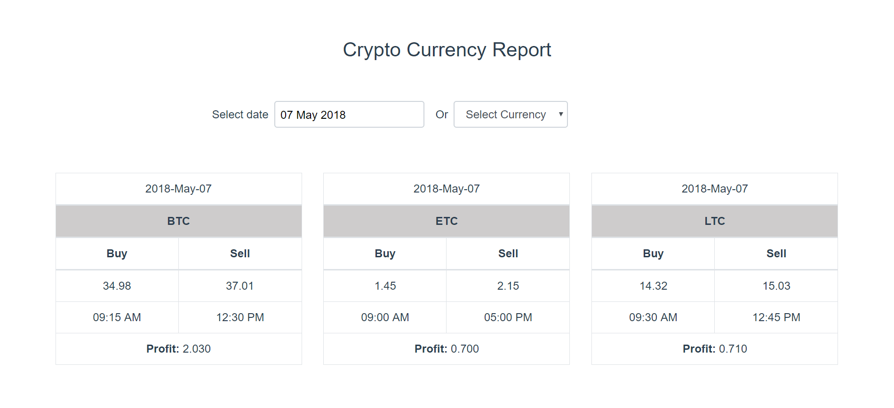
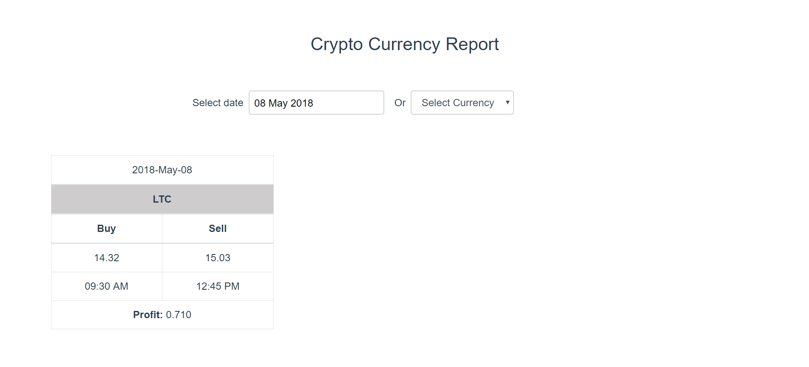
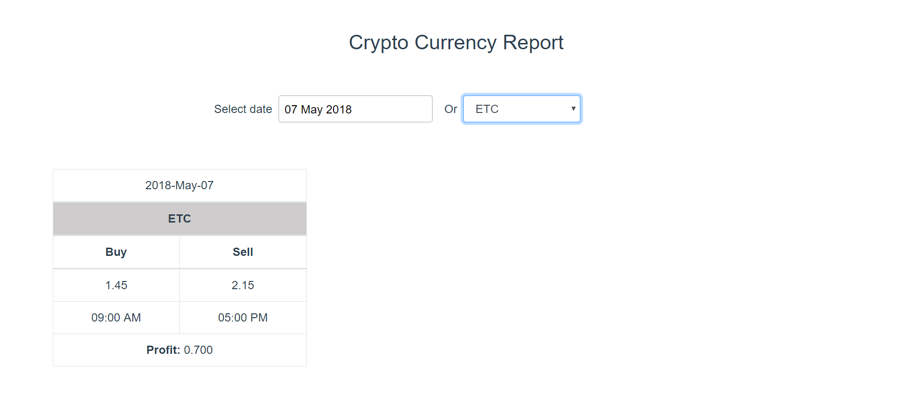

# CryptoCurrency Report

This project contains Frontend code written in Vue.js, api's written using Express.js, no sql DB with MongoDB. </br>
This project has both UI code and server code. Details about running the app are mentioned below. </br>
When we run the UI code, the app runs successfully with json file data. </br>
Server code needs to run separately which connects MongoDB using node.js/Express.js api's </br>

# Technologies Used:

Frontend: Vue.js, Bootstrap-4, eslint</br>

Api's: Node.js, Express.js</br>

Database: MongoDB</br>

Unit Tests: Jest</br>

E2E: Nightwatch</br>


To run the application, please follow below steps.

## Project setup
```
npm install
```

### Compiles and hot-reloads for development
```
npm run dev
```

### Compiles and minifies for production
```
npm run build
```

### Run your tests
```
npm run test
```

### Lints and fixes files
```
npm run lint
```

### Run your end-to-end tests
```
npm run test:e2e
```

### Run your unit tests
```
npm run test:unit
```

### Running server code
To run server code: go to server folder and run
npm start

The server starts with connecting MongoCloud Atlas and api's are ready to use.

### Screenshots




